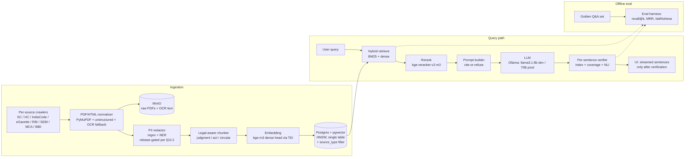

# Indian Primary Law RAG — Refined Plan

## Context

Self-hosted Retrieval-Augmented Generation system over Indian primary law (SC + 25 HCs + bare acts + regulator circulars, 25-year coverage). Serves cited, streaming answers and similar-judgment retrieval. Dev runs on macOS / Apple Silicon with fully local OSS models via Ollama; production is Linux via Docker. No paid aggregators (no IndianKanoon, no Manupatra).

This document supersedes the earlier draft at `/Users/amitmishra/.claude/plans/quizzical-sleeping-journal.md` and bakes in corrections around legal/IP posture, PII, bare-act versioning, streaming-verification UX, HC adapter burden, latency claims, and sprint feasibility.

## Architecture



Key shift vs draft: PII redaction moved into the ingestion pipeline before chunking; verifier runs per-sentence and gates the stream rather than painting after-the-fact.

---

## 1. Corpus Acquisition

For each source: URL pattern, pagination, blockers, robots posture, plan.

### 1.1 Supreme Court — eSCR (multi-host fallback)

- **Primary URL pattern:** `https://digiscr.sci.gov.in/view_judgment?id=<UUID>`; listings under `/search` (POST with year/volume).
- **DNS / reachability note (2026-05-17):** `digiscr.sci.gov.in` returns NXDOMAIN from Google / Cloudflare public DNS — almost certainly geo-fenced to Indian DNS. `main.sci.gov.in` resolves but times out from non-Indian IPs. **Production crawler must run on India-region infra** (the managed-hosting choice in §13.4 should be India-region anyway). Cold-fetch session-cookie / CSRF behavior remains untested from outside India.
- **Alternative reachable hosts (probed 2026-05-17, HTTP 200):**
  - `https://scr.sci.gov.in/scrsearch/` — SCR (Supreme Court Reports) official search.
  - `https://judgments.ecourts.gov.in/KBJ/` — eCourts unified judgment portal (covers SC + HCs).
  - Internet Archive snapshots of `digiscr.sci.gov.in` (`web.archive.org/web/...`) for historical / blocked fetches.
- **Blockers:** reCAPTCHA on `/search` form; listing pages JS-rendered. Per-judgment view-page is the unblocked path once UUID is known.
- **robots.txt:** restrictive on `/search`.
- **Plan:** Seed via the HF SC corpus below (it carries judgment URLs / UUIDs that point back to eSCR), then fetch view pages directly for missing or recent items. Rate limit 1 req/s. Cache HTML + linked PDF.
- **HF SC fallback (verified 2026-05-17):**
  - **Primary candidate: `Rahul1872/Indian-Supreme-Court-Judgments`** — CC-BY-4.0, year-partitioned 1950–2025, English + regional separated, parquet metadata + tar of raw text. 76 years of coverage. Provenance not yet verified — must pass §10.1 50-doc sample inspection before ingestion.
  - **Backup mirror: `labofsahil/Indian-Supreme-Court-Judgments`** — same file structure as above, same CC-BY-4.0; treat as a fork-mirror.
  - **Earlier draft named `opennyaiorg/InJudgments-SC` and `ai4bharat/IndicLegalQA` — neither exists on HF.** OpenNyAI's actual datasets are `aalap_instruction_dataset` (legal SFT), `aibe_dataset` (bar exam), `InLegalNER` (useful for §10.2 PII NER, not as a corpus). ai4bharat has no legal datasets.
  - **`Exploration-Lab/IL-TUR`** exists but is a benchmark suite, not a corpus mirror.
  - **`KanoonGPT/indian-case-laws` and IndianKanoon-derived datasets are excluded** per the no-paid-aggregators constraint (§1.8 / §10.1).

### 1.2 Supreme Court — main.sci.gov.in & judis.nic.in

- `judis.nic.in` is largely superseded by eSCR; old judgments mostly accessible via eSCR now. Use only as a last resort for pre-eSCR gaps, via Internet Archive snapshots.

### 1.3 Bare acts — indiacode.nic.in

- **URL pattern:** `https://www.indiacode.nic.in/handle/123456789/<id>`; `/browse?type=actyear` for listings. DSpace-based.
- **OAI-PMH: confirmed disabled (2026-05-17 check).** `curl https://www.indiacode.nic.in/oai/request?verb=Identify` returns HTTP 404. Adapter must use handle-page crawling.
- **Plan:** handle-page crawl via `/browse?type=actyear` enumeration, then per-act fetch. Central Acts in full; State Acts not in slice (Maharashtra / Delhi / Karnataka are post-slice).
- **Version handling:** IndiaCode publishes both original and "as amended" PDFs. **Index both, and record `as_at` and `amendment_version` on every chunk** (see §3).

### 1.4 Gazette — egazette.gov.in

- ASP.NET ViewState, CAPTCHA on download, many scans.
- **Plan:** Targeted-only — fetch gazettes referenced by other sources. Skip blanket crawl.
- **Fallback note:** PRS India re-publishes parliamentary bills and select gazettes, but coverage is partial; don't assume PRS is a gazette mirror.

### 1.5 High Courts (25 portals) — realistic burden

**Reality check:** 25 adapters at ~2–3 days each + ongoing DOM-churn maintenance ≈ 50+ dev-days of just adapter work, before any judgment is ingested. Plan accordingly:

- **Tier A — direct scrape viable (~7 courts):** Delhi, Bombay, Madras, Karnataka, Punjab & Haryana, Calcutta, Allahabad, Kerala. Build adapters first.
- **Tier B — ecourts.gov.in unified portal (~10 courts):** Gauhati, Tripura, Meghalaya, Sikkim, etc. CAPTCHA on search; per-judgment view URLs are *sometimes* stable but the portal is notoriously brittle. Build a single ecourts adapter, accept partial coverage.
- **Tier C — infeasible (~3 courts):** Manipur, J&K, newer Telangana — sparse listings, frequent breakage. **HF datasets won't fully backfill this** (IL-TUR ≠ corpus mirror). Treat as known coverage gaps and surface in UI.

Common HC plan: one adapter per court under `packages/ingest/adapters/<court>.py`; snapshot-based tests so DOM changes are caught early.

**Roll-out:** ship slice with SC only. Add HCs Tier-A one at a time post-slice, gated on per-court eval coverage.

### 1.6 Regulators

- **RBI:** `rbi.org.in/Scripts/NotificationUser.aspx` — paginated by year; no CAPTCHA.
- **SEBI:** `sebi.gov.in/sebiweb/home/HomeAction.do?doListing=yes&sid=1&ssid=6&smid=0`.
- **MCA:** `mca.gov.in/...` for acts and circulars.
- **IBBI:** `ibbi.gov.in/legal-framework/notifications`.
- **Plan:** Direct scrape; 1 req/s; structured metadata from each row (date, ref no, subject).

### 1.7 Crawl plan (cross-cutting)

- `httpx` async + `playwright` only for JS-required portals.
- `urllib.robotparser` enforced; per-host token-bucket rate limit.
- Idempotent by `SHA-256(canonical URL)`; raw bytes in MinIO + `sources` row in Postgres.
- Polite UA: `IndianLawRAG-research/0.1 (+contact email)`.
- Retry with exponential backoff; alert on adapter failure rate >5% over 1h.

### 1.8 Infeasible at full scale → declared alternatives

| Source | Reason | Replacement |
|---|---|---|
| eGazette full crawl | CAPTCHA + scans + scale | Targeted fetch only |
| Some HC portals (Tier C) | Brittle / sparse | Accept coverage gap; surface in UI |
| Older SC (pre-eSCR) | judis.nic.in instability | Internet Archive snapshots + HF |
| Live IndianKanoon mirror | ToS prohibits | Skip entirely |

---

## 2. Retrieval Quality

### 2.1 Embedding model

- **Choice:** `BAAI/bge-m3` (1024-d dense head, 8K context, multilingual).
- **Indexing scope (v1):** **dense head primary in pgvector.** ColBERT multi-vector head deferred — non-trivial to store in pgvector.
- **Sparse head — planned v1.5 auxiliary signal.** bge-m3's sparse output is a token-weight dictionary; tractable to store (one extra `jsonb` or sparse-vector column) and score-fuse with BM25 at retrieval time. Not in the slice, but **reserve the schema column now** so v1.5 doesn't require a migration. This is the cheap way to plug the Devanagari gap in the `english` tsvector (§2.3) without committing to ColBERT storage.
- **Why:** Indian legal text is heavily code-switched (English + Devanagari + Latin legal phrases). 8K context is forgiving for long paragraphs.
- **Alternatives:**
  - `law-ai/InLegalBERT` — Indian-legal-specific but 512-token cap. Not a primary retriever. Optional: use its `[CLS]` vector as an auxiliary domain-classification feature in reranker input (not v1).
  - `jinaai/jina-embeddings-v3` — 8K multilingual. A/B candidate; bench on golden set.
- **Versioning:** every chunk row carries `embedding_model` and `embedding_version`. Re-embed selectively when bge-m3 updates.

### 2.2 Reranker

- **Choice:** `BAAI/bge-reranker-v2-m3` (cross-encoder, multilingual).
- **Alternative:** `jinaai/jina-reranker-v2-base-multilingual` — bench head-to-head.

### 2.3 Hybrid retrieval

- **Stage 1a:** BM25 via Postgres `tsvector` → top 100. **Note:** there is no built-in "Indian-English" tsvector config. v1 uses `english` (will miss Devanagari and many Hindi terms); v2 builds a custom dictionary. Document the known gap.
- **Stage 1b:** Dense bge-m3 cosine → top 100.
- **Stage 2:** Union, dedupe by chunk id, rerank top 200 with bge-reranker-v2-m3 → top 20.
- **Stage 3:** LLM consumes top 8 by default (configurable).

### 2.4 Eval harness

- **Golden set:** 100 Q&A hand-authored, distributed to match the common-public slice (end-user is the general Indian public, not lawyers — see Productization Track §13):
  - Consumer disputes (Consumer Protection Act 2019; e-commerce returns, defective goods, deficient services, builder cases): 20
  - Family law (Hindu Marriage Act, Special Marriage Act; divorce, maintenance, custody, domestic violence cross-refs): 20
  - Criminal procedure for victims/accused laypeople (BNS, key SC on bail / FIR / arrest rights): 20
  - Employment / wages (Code on Wages 2019, key Industrial Disputes provisions; non-payment, termination, gratuity, PF): 15
  - RTI Act (filing, appeals, exemptions, fee structure): 10
  - Motor Vehicles Act (accident claims, insurance, third-party liability, MACT): 15
- **Phrasing rule:** golden questions are written in lay vocabulary ("my landlord won't return my deposit", "how do I file an RTI for…") not legal vocabulary ("what relief under Sec X for breach of bailment…") — eval must measure usefulness to the actual target user, not to lawyers.
- **Anchor format:** `expected_anchors` are `(doc_id, paragraph_no)` tuples, **not chunk IDs** — so the golden set survives re-chunking.
- **Estimated effort:** ~5–10 dev-days of lawyer+engineer iteration to author 100 high-quality items. Sprint ships 50; rest follows.
- **Metrics:**
  - `recall@10`, `recall@20` against expected anchors.
  - `MRR@10`.
  - `citation_index_validity` — fraction of `[n]` tags resolved to a retrieved passage.
  - `nli_entailment_rate` — fraction of cited sentences entailed by their cited passage. **Caveat:** general-domain MNLI checkpoints (e.g., `MoritzLaurer/DeBERTa-v3-base-mnli`) under-perform on legal phrasing by an estimated 10–20%; track as known bias, pilot legal-NLI alternatives later.
  - `answer_correctness` — offline LLM-as-judge against `golden_answer`, scored 0/1/2. **Posture:** judge model is Claude API (not local). This is offline eval only and explicitly out-of-band from the "fully local OSS at runtime" constraint; gated behind `EVAL_JUDGE=claude` flag.
- **Implementation:** `packages/eval/`, pytest-driven, results to `eval/results/<git-sha>.json`. CI fails if `recall@10` drops >5 pp vs main.
- **Tools:** `ragas` where it fits; custom legal-anchor matcher otherwise.

---

## 3. Legal-Aware Chunking

Every chunk carries: `text`, `source_url`, `anchor`, `doc_id`, `page_no`, `token_count`, `chunk_strategy`, `embedding_model`, `embedding_version`, plus source-specific metadata. Dedup on `(doc_id, anchor, as_at)`.

### 3.1 SC / HC judgments

- **Primary splitter:** regex on numbered paragraphs (`^\s*(\d+)\.\s`).
- **Fallback splitter** (for older pre-2000 judgments without numbered paragraphs): semantic-window splitter (target ~600 tokens, sentence-aligned). Tag with `chunk_strategy=semantic` so eval can stratify.
- **>1000 tokens:** sub-split at sentence boundaries (`#para-12-a`, `#para-12-b`). Sub-chunks carry parent paragraph metadata so the verifier can reconcile.
- **Sliding lookaround:** store prev+next paragraph text as `context_lookaround` for reranker input only; do not embed.
- **Anchor:** `sc/2023/scc-453#para-12` or `delhi-hc/2024/CRL-A-123#para-7`.
- **Metadata:** `court`, `bench`, `parties`, `citation`, `date`, `statutes_referred[]`, `cases_cited[]`.
- **Citation extraction:** parse only court-issued judgment text. **Do not extract from SCC/AIR/SCC OnLine headnotes or syllabi** (publisher copyright — see §10).

### 3.2 Bare acts (IndiaCode)

- **Structure:** Chapter → Section → Sub-section → Clause → Proviso → Explanation.
- **Chunk:** one chunk per Section; if tokens > 800, split per sub-section.
- **Section header travels with sub-section chunks** (otherwise "(b)" is meaningless out of context).
- **Provisos/Explanations** stay attached to parent sub-section.
- **Anchor:** `companies-act-2013/sec-149(6)(b)@2024-04-01` or `it-act-1961/sec-80C/expl-2@2024-04-01`.
- **Metadata:** `act_short`, `act_full`, `year`, `section_no`, `marginal_note`, `as_at` (date the version is valid for), `amendment_version`, `last_amended`, `repealed` (bool), `repealed_by`.
- **Versioning policy:** index every amended version. **Retrieval pre-filters to a single `as_at` set before any passage reaches the LLM** — default is latest-as-of-today; override with `as_of:YYYY-MM-DD`. The LLM never sees mixed versions unless the question is explicitly about change-over-time, in which case retrieval returns multiple versions and prompt rule 8 (§4.1) kicks in. Tax/securities answers in particular *must* surface the `as_at` of cited sections.

### 3.3 Circulars / notifications

- **Chunk:** full circular if tokens ≤ 2000; otherwise split by headed sections.
- **Anchor:** `sebi/circular/CIR-CFD-2024-15#sec-3` or `rbi/master-direction/RBI-2023-DOR-001`.
- **Metadata:** `regulator`, `ref_no`, `date_issued`, `subject`, `supersedes[]`, `superseded_by`, `effective_from`.

### 3.4 Common

- Implementation in `packages/ingest/chunkers/{judgment,act,circular}.py`.
- Each chunker has unit tests on fixture HTML/PDFs.
- All anchors are URL-safe and double as deep links in the UI.
- **Sentence segmentation** (used by both chunker fallback and verifier): `pysbd` or `blingfire`, not naive `.split('. ')` — legal text breaks on "Sec.", "v.", "Ors.", "Hon'ble Mr.".

---

## 4. Citation Grounding

### 4.1 Prompt (cite-or-refuse, lay-friendly)

System prompt lives in `apps/api/prompts/answer.md`. End user is a layperson, not a lawyer — prompt is tuned for that.

```
You are helping members of the Indian public understand the law that applies
to their situation. You are NOT a lawyer and you do NOT give legal advice.
You are given numbered passages [1]..[K] retrieved from primary sources
(Acts of Parliament, court judgments).

User-language rules:
- Write in plain English. No Latin (no "prima facie", "mutatis mutandis",
  "in personam"). No unexplained legal jargon. If you must use a legal term
  (e.g. "bailable offence", "ex parte"), define it inline in plain words.
- Use short sentences. Active voice. No more than 25 words per sentence.
- Address the user directly as "you" when describing their position.

Citation rules:
1. Every factual claim about the law must be followed by one or more citation
   tags, e.g. [3] or [3][7]. Personal-situation observations ("you mentioned
   you live in Maharashtra…") do not need citations.
2. If the retrieved passages do not support a claim, respond:
   "The sources I have don't cover this clearly. I won't guess. You should
   talk to a lawyer for your specific situation."
   Do not use outside knowledge.
3. Never invent paragraph numbers, section numbers, or case names.
4. When quoting law verbatim, use exact text in quotes.
5. When citing a bare-act section, state the as-of date if provided.
6. Statute passages are time-scoped — each carries an `as_at` date.
   - "Current law" means the latest `as_at` available across the passages.
   - If the user asks about a specific date or period, use only passages
     whose `as_at` matches; do not mix versions in a single claim.
   - If passages span multiple `as_at` versions and the question is about
     "current" law, prefer the latest and ignore older versions silently.
7. If you must explain how a statute changed over time, label each version
   explicitly with its `as_at` date.

Required output format (use these section headings literally):

**Short answer**
(One paragraph, max 3 sentences. Tell the user the answer to their question
in plain words. Every factual sentence has a citation.)

**What this means for you**
(2-4 short paragraphs. Translate the law into how it applies to their
described situation. Every factual sentence has a citation. If the user did
not describe a situation, skip this section.)

**Why (the law)**
(2-4 short paragraphs. The legal reasoning, in plain words, with citations.
This is where statute names, section numbers, and case names appear.)

**What you can do next**
(Bullet list of 2-5 concrete next steps the user can take — e.g. "file a
complaint at the District Consumer Forum", "ask the magistrate to record
your statement under Sec X". Citations not required for procedural steps
that are obvious from cited passages.)

**Sources**
(Reproduce each [n] with statute name + section + as-of date, or
court + case name + year + paragraph. One source per line.)

**Disclaimer**
This is general legal information, not legal advice for your specific
situation. Laws and their interpretation change. For decisions that affect
your rights, consult a qualified lawyer or the relevant court / forum.
```

The disclaimer is **rendered server-side as a non-removable footer** on every answer (see §4.4), independently of whether the model includes it. The model emitting it is belt-and-braces; the UI guarantees it.

### 4.2 Verifier

Lives in `apps/api/verifier.py`. Runs **per-sentence, inline with streaming** (not after the stream ends).

- **Step 1 — index check:** parse `[n]` tags in the sentence; each must be in `retrieved_indices`. Unknown → `unknown_citation`.
- **Step 2 — coverage check:** every sentence must end with at least one citation tag, except designated meta-sentences (the refusal line). Uncited → `unsupported`.
- **Step 3 — entailment check** (on by default): NLI per cited sentence (sentence as hypothesis, cited passage as premise). `entailment_prob < 0.5` → `weak_support`. NLI checkpoint bias noted in §2.4.
- **Output:** `{ sentences: [{text, citations, status, evidence_score}], unsupported_count }`.

### 4.3 Streaming UX

**Topology — decouple internal generation from user emission:**

1. LLM streams tokens into an internal buffer (not yet visible to the user).
2. Sentence segmenter (`pysbd`) closes a sentence on the buffer.
3. Verifier runs (index → coverage → NLI) on the closed sentence.
4. Verified sentence is emitted to the user.
5. *Meanwhile* the LLM is already generating the next sentence into the buffer — verifier latency overlaps with continued generation, not with user-visible streaming gaps.

This preserves the no-unverified-output invariant without paying the verifier's latency in series with user perception. Post-hoc paint is rejected: a user who screenshots between stream and paint sees unverified text, which is the wrong default for legal answers.

**Failure mode — strict, because end users are laypeople trusting a paid product:**

- `weak_support` → emit, mark with a "verify with a lawyer" note on the sentence, surface entailment score on hover. Do **not** silently let weak claims through unmarked.
- `unsupported` or `unknown_citation` on a single sentence → **default: stop the stream immediately** and render a structured fallback (see below). One unsupported sentence in a legal answer to a layperson is a real harm; we do not tolerate it for trust reasons even if the rest of the answer was fine.
- Cumulative skip-ratio threshold (`SKIP_RATIO_STOP`) is configurable. **Default `0`** for the public product — any unsupported sentence stops the stream. Raise (e.g. to `0.10`) only behind a feature flag, with explicit logging, for internal evaluation. The earlier 30% default is rejected for the public product (it was sized for a research tool, not laypeople).
- **Structured fallback rendered on stop:** "The sources I have don't cover your question clearly enough for me to give a useful answer. Try rephrasing it more narrowly, or talk to a lawyer for your specific situation." Plus the standard disclaimer footer.
- **Segmentation-error safety net:** if the verifier flags a sentence as `unsupported` but a stricter post-stream re-segmentation shows the citation was on an adjacent sentence due to mis-split, downgrade to `weak_support`. Guards against killing answers on `pysbd` edge cases. Safety-net activations are logged for tuning, not silently suppressed.
- `/answer-fast` dev route: skip NLI, run index + coverage only, paint after stream. **Disabled in production** (env-gated, not just a route choice).

**Latency posture:** the per-sentence NLI cost is unknown until measured — the previous "30–80 ms" was a guess. Day 0 bench (§9) produces real numbers on this Mac with the real NLI model / device / batch shape. If sentence-NLI p95 exceeds ~200 ms, fall back to **batched-after-stream verification gated server-side**: hold the full answer at the server, run all-sentence verification as one batch, and only stream if skip ratio is acceptable. Document this fallback as the v1 default if the bench warrants it; the parallel-verifier topology above becomes v1.5.

### 4.4 UI behavior

- Stream sentences as they pass verification.
- Each sentence carries inline `[n]` chips; hover shows the source passage with anchor and deep link.
- Statute citations show `as_at` date in the popover.
- Source filter: by subject area (Consumer / Family / Criminal / Wages / RTI / Motor) + court (SC, Delhi/Bombay/Madras HC).
- **Coverage chip on every answer** — first-class, not buried. Shows what was actually searched in lay-friendly terms, e.g. "Consumer law ✓ · Family law ✓ · Criminal procedure ✓ · Motor accidents ✓ · SC 2019–2024 ✓ · Delhi/Bombay/Madras HC 2021–2024 ✓ · Other states / older judgments: not yet covered". Users must be able to tell when an answer is bounded by corpus limits rather than by law.
- **Disclaimer footer — non-removable, server-rendered.** Every answer, including refusals and fallbacks, ends with the standard disclaimer ("general legal information, not legal advice for your specific situation; consult a qualified lawyer"). Rendered by the server outside the LLM-generated content area; cannot be styled away or hidden by client code. Belt-and-braces with §4.1 rule asking the model to also emit it.
- **"Verify with a lawyer" inline badge** on every `weak_support` sentence — visible, not buried in a hover.

---

## 5. Scale

### 5.1 pgvector vs Qdrant

**Decision:** pgvector for dev and the first vertical slice; plan a clean migration path to Qdrant. Trigger migration when any of:
- corpus > 3M chunks, or
- p95 retrieval latency > 300 ms on target hardware (measured, not guessed), or
- payload-filter queries dominate (per-court, per-act faceting), or
- partition-fanout multiplies HNSW query cost beyond budget.

| Axis | pgvector | Qdrant |
|---|---|---|
| Ops simplicity | One DB | Extra service |
| Joins on metadata | Native SQL | Payload filters |
| Recall at HNSW | Very good | Very good |
| Speed @ 5M, p95 | needs bench | needs bench |
| Backup | `pg_dump` | Snapshot API |
| Quantization | halfvec only | Scalar/PQ in-product |

**Migration cost** is not zero: payload model maps differently; re-ingestion is a multi-day batch job. Budget 1–2 weeks when the trigger fires.

### 5.2 Index

- HNSW, `m=16`, `ef_construction=64` build, `ef_search=40` query initially.
- Bench `ef_search ∈ {20, 40, 80}` on golden set; pick smallest within 1 pp of brute force.
- IVFFlat rejected: lower recall, no real build-time win at our size.

### 5.3 Latency — bench-driven, not asserted

The draft asserted specific latency numbers. Replace with **targets to bench on Day 0** of the sprint:

| Corpus size | Vector search p95 (target) | End-to-end first-token p95 (target) |
|---|---|---|
| 1M chunks (slice) | < 150 ms | < 1.5 s |
| 5M chunks | < 300 ms | < 2 s |
| 10M chunks | < 500 ms — consider Qdrant | < 2.5 s |

Real numbers on M2/M3 Pro + halfvec are typically higher than the draft's claims; measure before promising. Reranker `bge-reranker-v2-m3` on MPS: bench batch-of-50 cost on Day 0 (expect 300–700 ms).

### 5.4 Sharding / partitioning

- **Default for v1 slice: single un-partitioned `chunks` table** with `source_type` as a btree-indexed filter column. Pre-filter via `WHERE source_type IN (...)` then HNSW search. Simpler schema, no cross-partition fanout, no UNION orchestration.
- **Partitioning is provisional** — only adopted if Q2 bench in `OPEN_QUESTIONS.md` shows un-partitioned p95 exceeds budget at projected 5M chunks. Postgres declarative partitioning on `source_type` (`sc_judgments`, `hc_judgments`, `bare_acts`, `circulars`) is the fallback design.
- Reason for the default flip: HNSW indexes are **per-partition** in pgvector, so cross-source queries (the normal case for legal questions) fan out and aggregate. The architectural cost of partitioning is real and should be paid only with evidence.
- Sub-partition HC by court once any single court exceeds ~500K chunks — *if* partitioning is adopted.
- Embedding storage: `halfvec(1024)`; int8 quantized cold tier out of scope for slice.

---

## 6. Ops

### 6.1 Docker Compose

`infra/docker-compose.yml`:
- `postgres` (pgvector 0.7+, `pg_trgm`, `pg_stat_statements`).
- `redis` (rate limits, query cache).
- `ollama` (LLM serving; host-mounted model dir).
- `tei` (text-embeddings-inference for bge-m3) — separate from API for batch throughput.
- `api` (FastAPI).
- `web` (Next.js).
- `minio` (PDFs + OCR text).
- `prometheus` + `grafana`.
- `crawler-runner` (cron container; idle by default in dev).

Volumes for `postgres-data`, `minio-data`, `ollama-models`. Internal network; only `web` (and optionally Grafana) exposed externally.

### 6.2 Model lifecycle

- `scripts/pull-models.sh` pulls `llama3.1:8b-instruct-q4_K_M`, `qwen2.5:7b-instruct-q4_K_M`, bge-m3 into TEI.
- Pinning: exact tag + digest in `infra/models.lock`; bumping is a deliberate PR.
- API startup runs `make doctor` which validates `models.lock` matches what's pulled.
- Pre-warm: one empty `/api/generate` to Ollama and one embedding to TEI on boot.

### 6.3 Backup / restore

- Postgres: `pg_dump -Fc` nightly → MinIO `backups/postgres/`; 7-day retention + weekly retained 4 weeks. **Encrypt at rest** (MinIO server-side encryption + per-bucket policy).
- MinIO PDF cache: `mc mirror` to remote S3 (user-supplied) weekly.
- Restore drill in `ops/RESTORE.md`: `scripts/restore.sh <date>`.
- Quarterly: test restore into a scratch compose stack.

### 6.4 Observability

- Structured logs via `loguru`, JSON to stdout.
- Per-request: `query_hash`, `retrieval_ms`, `rerank_ms`, `llm_ttft_ms`, `llm_total_ms`, `tokens_in`, `tokens_out`, `unsupported_count`, `weak_support_count`, `skipped_sentence_count`, `skip_ratio`, `as_of` (statute version actually used).
- Prometheus metrics: `rag_retrieval_latency_seconds`, `rag_rerank_latency_seconds`, `rag_llm_ttft_seconds`, `rag_unsupported_claims_total`, `rag_weak_support_total`, `rag_skip_ratio` (histogram), `rag_query_total{source_filter}`.
- Pre-built Grafana dashboards in `infra/grafana/`.
- Optional OpenTelemetry traces.

---

## 7. Portability (Mac → Linux)

Checklist in `ops/PORT.md`:

- Multi-arch images: `docker buildx build --platform linux/amd64,linux/arm64`. **Verify TEI image** supports both arches (it does for amd64; arm64 support varies by release).
- On Linux + NVIDIA: install `nvidia-container-toolkit`; set `runtime: nvidia` on `ollama`; confirm CUDA version matches Ollama build.
- Re-pull Ollama models on target — `scripts/pull-models.sh` is idempotent.
- Postgres: `pg_dump -Fc` on Mac → `pg_restore` on Linux; verify pgvector extension version matches.
- PDF cache: `mc mirror minio-mac/ minio-linux/`.
- `.env.example` lists every required var; `make doctor` checks them.
- **LLM swap for production:**
  - Mac dev: `llama3.1:8b` or `qwen2.5:7b` (Q4_K_M).
  - Linux prod (≥48 GB VRAM): `llama-3.3-70b-instruct-q4_K_M` or `qwen2.5-72b-instruct-q4_K_M`.
  - Change `LLM_MODEL` env var only.
  - **Expectation:** retrieval metrics within ~1 pp of Mac baseline; **`citation_faithfulness` and `answer_correctness` will shift materially** with the larger model — prompts likely need re-tuning at 70B. Plan a re-bench + prompt-tune cycle as part of the cutover.
- Run `make eval` on target; compare retrieval and verifier metrics.

---

## 8. Risk Register

| # | Risk | Likelihood | Impact | Mitigation |
|---|---|---|---|---|
| 1 | Source scraping breaks (CAPTCHA, DOM churn across 25 HCs, IP bans) | High | High | Per-host snapshot tests; HF datasets as floor where they apply; conservative rate limits; alerting on adapter failure rate; declared Tier-C gaps surfaced in UI |
| 2 | OCR quality on older scanned judgments poisons embeddings | High | Med | Confidence threshold (tesseract conf < 70 → flag); `ai4bharat/IndicOCR` for Indic-script PDFs; OCR-quality badge in UI; flagged chunks excluded from retrieval by default |
| 3 | Hallucinated citations despite cite-or-refuse | Med | High | Per-sentence verifier (index + coverage + NLI) gates the stream; strict mode is default; tracked as release-gating metric |
| 4 | Retrieval drift across legal domains (bge-m3 generic; polysemy of legal terms) | Med | Med | Hybrid BM25+dense; per-domain eval subsets; reranker; plan a light reranker fine-tune on InLegalBERT-style pairs after slice ships |
| 5 | Full-corpus build cost (10M chunks × embedding × HNSW build = weeks; ~40 GB embeddings) | High | Med | Vertical slice first; incremental HC onboarding; halfvec storage; resumable batch jobs with checkpointing |
| **6** | **Publisher copyright leakage (SCC/AIR/SCC OnLine headnotes are copyrighted per *Eastern Book Co. v. D.B. Modak*, 2008)** | **Med** | **High (legal exposure if hosted publicly)** | **Parse only court-issued versions; never ingest publisher-formatted PDFs; per-source allowlist enforced in normalizer; legal review before any public release** |
| **7** | **PII in judgments (Aadhaar, phone numbers, minor names, sexual-offence victim identifiers)** | **High** | **High (PII leak vector; courts increasingly mandate redaction)** | **Redaction pass in normalizer before chunks land in retrieval. v1 slice: regex only (Aadhaar / phone / PAN), shipped localhost-only. v2 (release gate): + NER for minor/victim names + 200-doc PII eval (§10.2). Deny-list expanded as cases surface; redaction confidence logged per chunk.** |
| 8 | Bare-act version skew (Sec 80C as on 2024 ≠ as on 2010) | Med | High (wrong tax/securities answers) | Mandatory `as_at` and `amendment_version` on every chunk; queries default to latest-as-of-today; `as_of` query parameter exposed in API; popover surfaces version |
| 9 | Embedding model upgrade (re-embedding 10M chunks is expensive) | Low (per year) | Med | `embedding_model` + `embedding_version` columns; selective re-embed jobs; never silently swap |
| 10 | ToS posture of court portals (some forbid scraping/republication independent of robots.txt) | Med | Med | Pre-launch ToS review per source; "research-use, non-commercial, attribution" framing; takedown contact published |

---

## 9. Sprint plan — realistic ~3 weeks

The 14-day version in the draft was 30–50% under-scoped. Two options:

### Option A: 15 working days (~3 weeks) full-scope slice

Recommended. **Slice scope (common-public pivot — see §13 Productization Track for why):**
- Bare acts: Consumer Protection Act 2019, Hindu Marriage Act 1955, Special Marriage Act 1954, Bharatiya Nyaya Sanhita 2023 (BNS), Code on Wages 2019, Right to Information Act 2005, Motor Vehicles Act 1988 (post-amendment).
- Supreme Court: last 5 years of judgments tagged to the above subject areas (consumer, family, criminal procedure, employment, RTI, motor accident).
- High Courts: last 3 years from Delhi, Bombay, Madras on the same subject areas (Tier-A adapters only).
- Total target: ~1M chunks, end-to-end with citations + lay-friendly UI + per-source eval.
- **Out of slice (deliberate):** Companies Act, IT Act, SEBI circulars, IBC — corporate/securities domain is wrong for the target user.

**Day 0 — bench**
- Bench HNSW (`ef_search ∈ {20,40,80}`) on a 100K-chunk seed.
- Bench bge-m3 embedding throughput on Mac MPS (target 50–100 emb/s).
- Bench bge-reranker-v2-m3 batch-50 latency on MPS.
- Bench llama3.1:8b TTFT on Ollama.
- Outcome: confirm or revise the §5.3 latency targets before designing around them.

**Days 1–2 — skeleton**
- Repo layout: `apps/{api,web}`, `packages/{ingest,chunking,retrieval,eval}`, `infra/`, `ops/`.
- `infra/docker-compose.yml`: postgres+pgvector, redis, ollama, tei, minio.
- DB schema: `sources`, `documents`, `chunks(embedding halfvec(1024), embedding_sparse jsonb /* reserved for v1.5 bge-m3 sparse head, §2.1 */, anchor, metadata jsonb, as_at, source_type, embedding_model, embedding_version, chunk_strategy)`. **Single un-partitioned table** with btree on `source_type` (matches §5.4 default). Partitioning is post-slice and conditional on Q2 bench.
- `scripts/pull-models.sh`.

**Days 3–5 — ingest adapters + redaction**
- SC adapter via HF (verify dataset exists per Q8) — fastest unblock; eSCR direct-fetch as follow-up. Filter HF subset to the 6 subject areas.
- IndiaCode adapter (verify OAI-PMH responds per Q6; fallback to handle-page crawl). Pull: Consumer Protection 2019, Hindu Marriage 1955, Special Marriage 1954, BNS 2023, Code on Wages 2019, RTI 2005, Motor Vehicles 1988.
- HC adapters: Delhi, Bombay, Madras (Tier A — direct scrape). Filter by subject area.
- PDF → text via PyMuPDF; OCR fallback (`ocrmypdf`) gated on text-density heuristic.
- **PII redactor — regex + NER in slice** (Aadhaar / phone / PAN regex; spaCy / `ai4bharat/IndicNER` for person names in sensitive case types per §10.2). Paid public product can't ship regex-only.
- Runs after normalize, before chunking. Unit-tested on synthetic fixtures.

**Days 6–7 — chunking + embeddings**
- `packages/chunking/{judgment,act,circular}.py` with fixture-based tests.
- Numbered-paragraph splitter + semantic-window fallback.
- Bare-act chunker emits `as_at` and `amendment_version`.
- Batch embedder against TEI; insert with HNSW.
- Target: ~1M chunks ingested + indexed.

**Day 8 — retrieval API**
- FastAPI `/search` (hybrid BM25+dense → rerank → top 20).
- FastAPI `/answer` (SSE stream) — retrieve → prompt build → Ollama stream.

**Days 9–10 — citation grounding (per-sentence)**
- Cite-or-refuse prompt finalized.
- Verifier: per-sentence index + coverage + NLI; gates the stream.
- Sentence segmentation via `pysbd`.
- `/answer-fast` dev-only route that skips NLI.
- `verification` payload returned alongside answer.

**Days 11–13 — Web UI**
- Next.js: query input, sentence-by-sentence streamed answer, citation popovers with `as_at` for statutes, source filters (SC / acts / SEBI).
- Strict-mode is default; insufficient-support fallback rendered server-side.
- **Cut from slice:** `/similar` endpoint, "strict toggle" (always strict in v1).

**Day 14 — eval**
- 50 Q&A golden subset with `(doc_id, paragraph_no)` anchors.
- `make eval` runs pytest, dumps JSON, compares with previous run.
- Metrics: `recall@10`, `MRR`, `citation_index_validity`, `nli_entailment_rate`. `answer_correctness` behind `EVAL_JUDGE=claude` flag, run manually.

**Day 15 — minimum-viable ops + buffer + demo**
- Prometheus metrics endpoint live (raw metrics; no Grafana dashboards in slice).
- Backup script + restore drill.
- README, `.env.example`, `ops/PORT.md` (checklist only — actual multi-arch build deferred), `ops/RESTORE.md`.
- Bug bash + internal demo (5 representative queries).
- **Explicitly deferred from Day 15:** Grafana dashboards, `docker buildx` multi-arch build, scratch Linux VM smoke test. These were what overstuffed the day; cut so the demo isn't rushed.

### Option B: 14 days, narrower scope

If 14 days is non-negotiable, drop: `/similar`, source filters in UI (single global view), bring eval to Day 13, push the bench-Day-0 outputs to a shared doc rather than re-tuning §5.3 in-sprint.

### Post-slice (not in sprint)

- `/similar` endpoint via holdings-paragraph embeddings (note: extracting "holdings" is non-trivial — likely heuristic-based for v1, with quality target TBD).
- HC adapters (Tier A first).
- Custom Indian-English tsvector dictionary.
- ColBERT-style multi-vector retrieval.
- Reranker fine-tune on legal pairs.
- **Grafana dashboards** (Prometheus metrics live in slice; visualization layer post-slice).
- **Linux multi-arch build** (`docker buildx linux/amd64,arm64`) + scratch-VM smoke test.
- **Postgres partitioning** (only if Q2 bench shows un-partitioned HNSW exceeds p95 budget).
- bge-m3 sparse head as auxiliary retrieval signal (column reserved in v1 schema; population + fusion is v1.5).
- PII NER fine-tune on a legal-NER dataset (general NER is in slice; a domain-tuned NER post-slice raises the precision/recall bar from §10.2 floor).

---

## 10. Legal & PII posture (new section)

Treat this as a release-gating section before any hosting beyond local dev.

### 10.1 Copyright

- **Bare acts and government works:** uncopyrighted in India per §52(1)(q) Copyright Act 1957. Safe to ingest from IndiaCode.
- **Judgment text:** government works, uncopyrighted.
- **Publisher headnotes / syllabi / paragraph schemes (SCC, AIR, SCC OnLine, Manupatra):** copyrighted per *Eastern Book Co. v. D.B. Modak* (2008) 1 SCC 1. **Never ingest from publisher PDFs.** Source-allowlist enforced in normalizer rejects URLs from publisher domains.
- **Regulator circulars:** government works, safe.
- **HF / third-party dataset provenance (release-gating):** before ingesting any HF dataset:
  - License must be CC-BY / CC0 / MIT / Apache or equivalent — anything restrictive or unclear is rejected.
  - Random-sample 50 docs and inspect for publisher artifacts: SCC headnote markers, AIR formatting conventions, paragraph schemes that match copyrighted layouts, embedded editorial summaries.
  - Reject datasets that mix court-issued text with publisher-derived text unless per-document provenance metadata lets us filter to court-issued only.
  - Log `dataset + version + license + sample-review-result` in `ops/SOURCES.md`. No HF data enters the pipeline without an entry there.

### 10.2 PII — in-slice, release-gating

Because v1 ships as a paid public product (not a research tool), PII redaction is **release-gating in the slice**, not post-slice. Regex-only is not acceptable for laypeople accessing a hosted product.

- Indian judgments routinely include Aadhaar numbers, mobile numbers, minor names, sexual-offence victim identifiers.
- Madras HC (2021), Kerala HC (2023), and others have issued redaction guidelines; SC has redaction practice in `POCSO` matters.
- **Redaction pipeline (in normalizer, before chunking) — all stages in slice:**
  - **Regex pass:** Aadhaar (12-digit + Verhoeff check), Indian mobile (+91 / 10-digit), PAN, bank account patterns.
  - **NER pass:** `ai4bharat/IndicNER` primary, spaCy `en_core_web_lg` fallback, for person names in sensitive case types (POCSO, matrimonial, juvenile, NDPS-with-minor).
  - **Case-type deny-list:** aggressive redaction in POCSO, matrimonial, JJ Act, NDPS-with-minor (case-type detected from header / cause-title regex; conservative defaults — if uncertain, redact).
  - Redaction confidence logged per chunk; chunks below the bar quarantined (not silently excluded).
- **Release gate — must pass before any non-localhost deployment:**
  - **200-doc PII eval set,** hand-labeled across POCSO / matrimonial / juvenile / standard case types. Built **in the slice timeline** (see §9 — added as a parallel workstream alongside ingestion, with lawyer + engineer time budgeted; sprint extends if the eval set isn't ready).
  - **Regex stage:** ≥0.99 precision (false positives shred retrieval text), ≥0.95 recall on Aadhaar / phone / PAN.
  - **NER stage:** ≥0.90 precision, ≥0.80 recall on person names in sensitive case types.
  - **"Low confidence" definition:** NER score <0.7 on a sensitive-case chunk → quarantine to a human-review queue. Chunks with any pattern flagged-but-unredacted are also quarantined. Quarantined chunks are excluded from retrieval but visible in admin tooling.
- **Known coverage gap (documented in UI):** general NER is weak on transliterated Indian names, initials, party aliases, OCR noise. v1 ships this gap explicitly; a legal-NER fine-tune lives in the Productization Track (§13).
- **UI disclaimer:** every answer view shows "Redaction is best-effort; report leaks to <contact>." Independent of the §4 legal-advice disclaimer.
- **Hard constraint:** no non-localhost deployment until release gate passes. CI block: a Linux deployment pipeline cannot run if `pii-gate.json` is missing or `passed: false`.
- **Schedule reality check:** building a 200-doc labeled eval set across four case types is **~5–7 dev-days of lawyer+engineer work**. The 15-day engine slice cannot absorb this and the rest of the build at the same time. Realistic options: (a) extend slice to 20–22 days, (b) ship engine slice locally and run PII eval in parallel as a separate workstream that lands before the productization track starts. Recommend (b).

### 10.3 Terms of Service & legal posture (commercial product)

The product is paid + ad-supported (see §13 Productization Track), so the "research use, non-commercial" framing of earlier drafts no longer applies.

- Per-source ToS review before any public release; track in `ops/SOURCES.md`. Some court portals may forbid commercial republication even when robots.txt allows scraping; legal review required.
- Product-level ToS, Privacy Policy, and "Information, not advice" disclaimer infrastructure lives in §13.
- Published takedown contact (DMCA-equivalent + court-takedown contact + PII-leak contact, all routed to one address with SLA).
- Liability shielding: ToS must include "no warranty as to accuracy", "no attorney-client relationship", "not legal advice", and a binding-arbitration clause for India seat. Lawyer review before any signed user accepts.

---

## 11. Critical files

- `infra/docker-compose.yml`, `infra/models.lock`
- `packages/ingest/adapters/{sc_hf,indiacode,sebi,delhi_hc,...}.py`
- `packages/ingest/normalize/{pdf,ocr,redact}.py`
- `packages/chunking/{judgment,act,circular}.py` + fixtures + tests
- `packages/retrieval/{hybrid,rerank}.py`
- `apps/api/main.py`, `apps/api/verifier.py`, `apps/api/prompts/answer.md`
- `apps/web/` (Next.js App Router; pages for `/`)
- `packages/eval/{golden.jsonl, run.py, metrics.py}`
- `ops/{PORT.md, RESTORE.md, SOURCES.md}`
- `scripts/{pull-models.sh, restore.sh, bench-day0.sh}`

---

## 12. Verification (end-to-end)

- `docker compose up` on Mac → all services healthy (`make doctor`).
- `make ingest-slice` → ~1M chunks indexed; chunks row count + per-source breakdown matches expected.
- `make eval` → JSON results with `recall@10 ≥ 0.7`, `citation_index_validity ≥ 0.95`, `nli_entailment_rate ≥ 0.80` on the 50-Q golden set, **broken out per subject area** (Consumer / Family / Criminal / Wages / RTI / Motor) so coverage thinness is visible per-domain, not hidden behind an aggregate average. Each domain ships with a minimum sample of 5 questions.
- Manual: 5 demo queries across consumer / family / criminal procedure / wages / RTI (e.g. "shopkeeper sold me a defective phone, what do I do" / "can my husband evict me from our marital home" / "police didn't register my FIR" / "company hasn't paid me 2 months salary" / "my RTI was rejected, can I appeal"); verify per-sentence streamed answer, lay-friendly response format, working `[n]` popovers with `as_at` for statutes, strict-mode refusal on a deliberately out-of-scope query (e.g. ask a corporate-law question), and the "information not advice" disclaimer is visible.
- Spot-check redaction: query for a known POCSO case; verify no minor names in retrieved chunks.
- Port: rerun `make eval` on a Linux target; retrieval metrics within 1 pp of Mac, answer metrics noted as expected-to-shift if LLM is swapped.

---

## 13. Productization Track (~3–6 months past the engine slice)

The 15-day slice (§9) gets the engine right: corpus + retrieval + citations + lay-friendly streaming, evaluated. It does not produce a shippable paid public product. This section is the **skeleton of work between "engine done" and "paid public product live"**, sized roughly so the gap is visible and plannable. Every subsection assumes the engine slice has shipped and §10.2 PII release gate has passed.

### 13.1 Commercial surface — auth, billing, ads (~3–4 weeks)

- **Auth:** email + OTP (SMS via MSG91 / Karix) primary; Google / Apple SSO secondary. Phone-number-as-identity matches Indian user habits and DPDP consent patterns. No passwords in v1.
- **Accounts:** minimal — phone, email, language preference, jurisdiction (state) for forum-specific guidance.
- **Billing:** subscription via Razorpay (UPI + cards + netbanking + wallets). Plans: free tier (rate-limited, ad-supported) + paid (no ads, higher rate limits, longer answers). GST handling via Razorpay.
- **Ads:** Google AdSense or an Indian ad network. **Strict policy: no contextual ads on answer pages** — only on landing / history / dashboard. Reason: an ad next to legal information looks like sponsorship and erodes trust.
- **Rate limiting:** per-account + per-IP at Redis; abuse handling (account suspension, IP block).

### 13.2 DPDP Act 2023 compliance (~2–3 weeks, plus legal review)

- **Consent management:** explicit opt-in at signup, separate consent for analytics and ads (not bundled), withdrawal flow that actually deletes (not soft-flag).
- **Data localization:** legal queries are sensitive; default to India-region hosting (AWS Mumbai / GCP Mumbai / Azure Pune). Cross-border data transfer only with explicit consent + permitted-country list.
- **Breach notification:** 72-hour DPDP timeline; runbook in `ops/INCIDENT.md` (created in this track).
- **DPO / Grievance Officer:** mandatory above thresholds; appoint and publish contact.
- **Children's data:** users <18 cannot register without verifiable parental consent; current bar is hard to meet at scale — likely policy is "18+ only" with age-gate at signup. Legal review required.
- **Audit logging:** every query + response stored with `user_id`, `as_of`, `coverage_chip_state`, `verifier_state`, retention 90 days minimum, longer for support cases. Encrypted at rest.

### 13.3 ToS / Privacy / Disclaimer infrastructure (~1–2 weeks + lawyer)

- **Terms of Service:** "no warranty as to accuracy", "no attorney-client relationship", "not legal advice", binding-arbitration clause (India seat). Clickwrap at signup, version-tracked, re-prompted on material change.
- **Privacy Policy:** DPDP-compliant, covers data flows for retrieval, observability, ads, analytics.
- **"Information not advice" disclaimer:** rendered server-side, non-removable, on every answer (§4.4). Plus a one-time onboarding modal that the user has to acknowledge ("I understand this is not legal advice").
- **Takedown / report flow:** PII-leak report contact, content-correction request, court-takedown contact. SLA: acknowledge in 24h, action in 7 days for PII, 30 days for content.
- **Lawyer review** of the above before any external user signs up. Not optional.

### 13.4 Managed hosting + ops at scale (~3–5 weeks)

- **Migrate from Docker Compose to managed cloud.** Recommended: GCP Mumbai (preferred for India residency + reasonable GPU pricing) or AWS Mumbai.
- **Postgres:** Cloud SQL / RDS for Postgres with pgvector extension. Self-hosted Postgres for production legal SaaS is the wrong default — backups, failover, point-in-time recovery, security patching are real ops cost.
- **LLM serving:** dedicated GPU instance (one A100 80GB or 2× L4 for the 70B model). Auto-scaling is hard with stateful LLM; start single-instance with queue + circuit breaker, scale vertically first.
- **Vector index:** if Q2 bench in OPEN_QUESTIONS forces Qdrant, run Qdrant Cloud or managed equivalent.
- **CDN + DDoS:** Cloudflare in front of the web tier. Legal sites get targeted scraping + occasional retaliatory DDoS — not paranoia.
- **Observability:** migrate Prometheus to a managed stack (Grafana Cloud / Datadog / CloudWatch), keep the same metric names from §6.4.
- **Backup encryption + off-site:** managed backups + monthly export to a separate cloud account.
- **CI/CD:** GitHub Actions → managed runner → deploy to staging → smoke-test → promote to prod. PII release-gate check is a CI step (cannot deploy if `pii-gate.json` is missing or fails).

### 13.5 Product analytics + customer support + safety ops (~2–3 weeks)

- **Product analytics:** PostHog (self-hosted in India region) or equivalent — query funnels, drop-off, time-to-first-token, user satisfaction signals. Distinct from §6.4 service metrics.
- **Feedback loop:** thumbs-up / thumbs-down on every answer + free-text reason. Negative feedback queued for human review; feeds into eval set expansion.
- **Customer support:** initial — email + WhatsApp Business (free tier, fits user habit) + an in-app "report this answer" button. Triage and a single human reviewer for legal-correction reports; SLA 7 days.
- **Safety ops:** weekly review of negative feedback + flagged answers; legal advisor on retainer for content correction calls. Budget: ~5 hours/week of a junior lawyer's time initially.

### 13.6 Multilingual UI scaffold — post-launch wave 1 (~4–6 weeks)

- **First languages:** Hindi (largest user base), Tamil + Bengali (early signal from user research). Marathi, Telugu, Gujarati follow.
- **UI i18n:** `next-i18next` or equivalent; strings in `apps/web/locales/<lang>/*.json`. RTL not needed for these languages (all LTR scripts). Devanagari / Tamil / Bengali script rendering tested across mobile browsers.
- **Query handling:** automatic language detection on the query (`fasttext-lid`); user can override. Retrieval works as-is because bge-m3 is multilingual.
- **Prompt translation:** the system prompt (§4.1) lives in language-specific files (`answer.hi.md`, `answer.ta.md`, etc.). **Each translation must be reviewed by a native-speaker lawyer** — bad legal phrasing in the prompt damages every output.
- **Response language:** LLM answers in the query's language. The disclaimer footer (§4.4) is rendered in the user's language, server-side.
- **Risk:** llama3.1:8b is weak in non-English Indic; either upgrade to a stronger multilingual model (Sarvam-1, BharatGPT, or 70B llama with strong system prompt) or restrict initial languages to those where the model is competent. Bench before committing.

### 13.7 Indic audio — post-launch wave 2 (~6–10 weeks)

- **STT (voice input):** code-switched Indic-English STT is hard; main options are AI4Bharat's IndicConformer / IndicWav2Vec, Whisper large-v3 (decent on Hindi-English code-switch, weaker on other Indic), or commercial API (Google Speech-to-Text, Azure). Likely need an A/B between AI4Bharat and Whisper for the use case.
- **TTS (voice output):** AI4Bharat IndicTTS (open) or commercial (Google Cloud TTS, AWS Polly). Quality of open Indic TTS has improved but still uneven across languages.
- **Architecture:** STT and TTS are stateless services, run on the same GPU host as the LLM in batched mode, or on a CPU host if quality permits.
- **UX:** push-to-talk button on mobile; the *answer* is read aloud only if the user opts in (a paid product reading legal "information" aloud carries the same disclaimer concerns as text — disclaimer is read aloud too).
- **Latency:** STT + retrieval + LLM + verifier + TTS in a streaming pipeline is hard; target end-to-end <5s on a mid-tier Indian mobile network.

### 13.8 Timeline + sequencing

A serial reading of the above sums to ~5–6 months by a small team. Parallelism opportunities:

- Weeks 1–4 post-slice: §13.2 (DPDP) + §13.3 (ToS/Privacy) + 200-doc PII eval (§10.2 release gate) in parallel by different people (engineer + lawyer).
- Weeks 3–7: §13.1 (auth/billing/ads) + §13.4 (managed hosting migration) in parallel.
- Weeks 6–10: §13.5 (analytics/support/safety).
- **Beta program (weeks 8–10):** 50–100 invited beta users from law-school networks + consumer-rights NGOs. Surface real query patterns to feed eval expansion.
- **Public launch (week 10–12):** soft launch in English only; defer multilingual + audio.
- Weeks 12–18: §13.6 (multilingual wave 1) post-launch, based on actual user-language distribution.
- Weeks 18–28: §13.7 (audio) — only if user demand from multilingual launch supports it.

Net: from engine-slice-shipped to English-only paid product live ≈ ~10–12 weeks; to multilingual ≈ +6–8 weeks; to audio ≈ +6–10 weeks. **Total horizon: ~6 months for fully-featured paid product.**

This is an estimate, not a commitment. Multiple things will slip: PII eval will take longer than expected (it always does), lawyer review will introduce non-negotiable changes to ToS and prompts, and the multilingual prompt-translation quality bar will surface real model limitations that need work-arounds.
